# tlias智能辅助系统+血压助手小程序

本项目是使用 Spring Boot3 + Vue3 + MySQL + 微信小程序 + ECharts 框架开发的一套高血压助手小程序和智能后台管理系统。
小程序端主要功能有：


## 技术栈

- 后端框架
  - SpringBoot
  - mybatis
  - hutool
  - aliyun oss
  - jwt
- 数据库
  - MySql
- 前端框架
  - Vue
  - ElementUI
  - Vue-Router
  - Axios
  - ECharts
  - 微信小程序

## 功能模块
    
## Windows 开发环境搭建

1. 安装 Java JDK 17 并配置环境变量
2. 安装 MySQL8.0、Redis 数据库并创建相应数据库

   - 创建 MySQL 数据库与表: 运行 [mysql.sql](./assert/tlias.sql)

3. 安装 Maven 构建工具
4. 克隆项目到本地 `git clone https://github.com/ScholarChen20/tliasWeb.git `
5. 修改配置文件 [application.yml](./src/main/resources/application.yml)

    ```yml
    spring:
       datasource:
          driver-class-name: com.mysql.cj.jdbc.Driver
          url: jdbc:mysql://localhost:3306/数据库名
          username: mysql用户账号
          password: mysql用户密码
    mybatis:
       mapper-locations: classpath:mapper/*.xml  #配置mapper文件位置
       configuration:
       log-impl: org.apache.ibatis.logging.stdout.StdOutImpl  #日志输出到控制台
       map-underscore-to-camel-case: true  #驼峰命名规则
    server: 
       port: 8080
    aliyun:   #阿里云配置,用于文件上传
       oss:
          endpoint: https://oss-cn-beijing.aliyuncs.com  #oss域名
          bucketName: xxxxx    #bucket名称
          region: xxxxx  #域名
    wx:   #微信配置
       appId: xxxxx #微信公众号appid
       appSecret: xxxxx  #微信公众号appsecret
    ```
6. 配置node.js运行前端框架，前端代码为vue-tlias-management文件夹，安装相应的插件配置即可
7. 配置微信小程序，小程序代码为mp-HBP文件夹，修改yml文件中的appid和secret即可 
8. 修改配置文件 [logback.xml](./src/main/resources/logback.xml),替换成自己修改的日志保存地址
    ```yml
     <FileNamePattern>D:/JavaEnv/JavaPro/Web-Ai/tlias-%d{yyyy-MM-dd}-%i.log</FileNamePattern>
    ```
   
9. 运行SpringBoot框架和前端界面即可 
10. 血压助手小程序展示
11. 
### 小程序登录

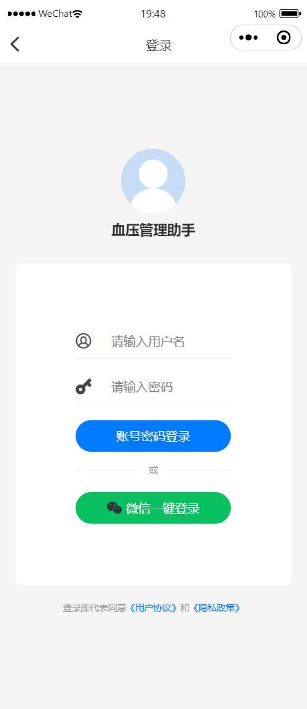

### 首页

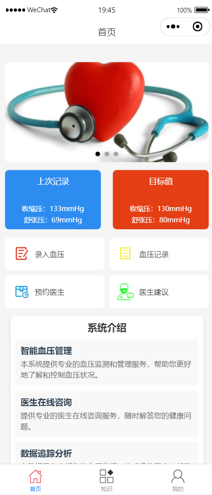

### 个人中心

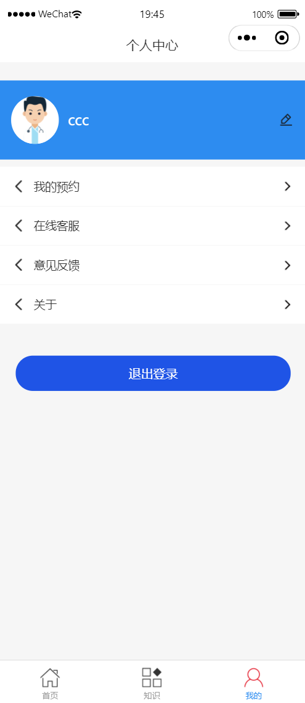

### 信息修改

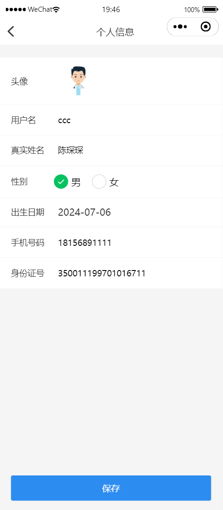

### 医生预约

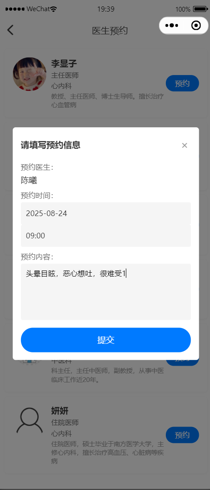

### 预约记录

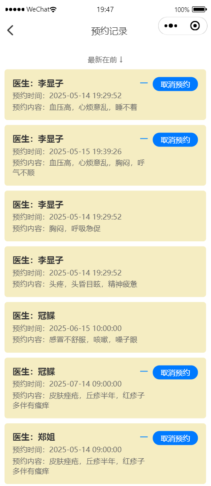

### 血压文字显示

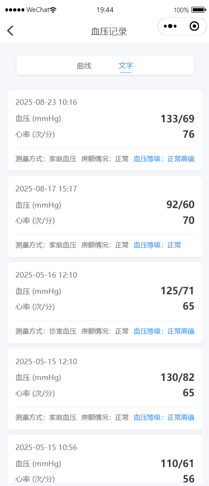

### 血压记录可视化

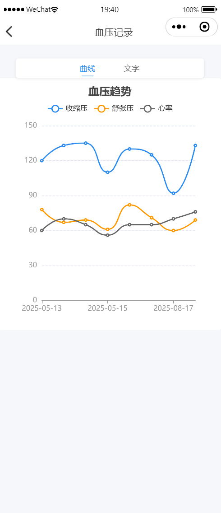

### 血压记录

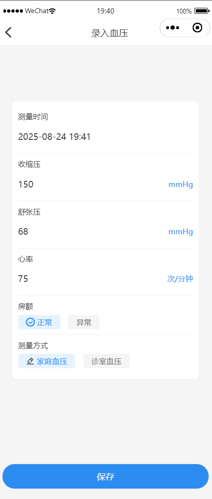

### 科普文章

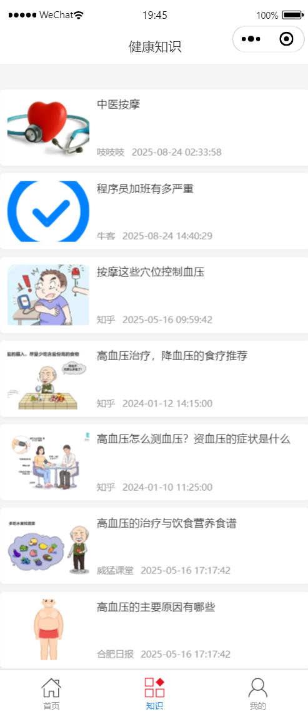

### 医生建议

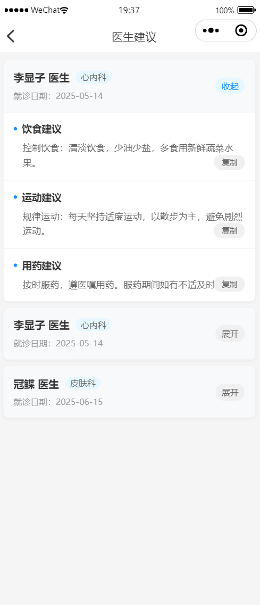


11. 后台系统展示

### 登录界面


### 系统首页


### 血压记录管理

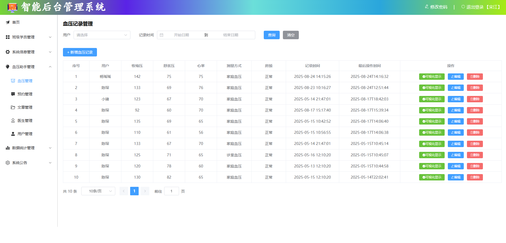

### 预约管理

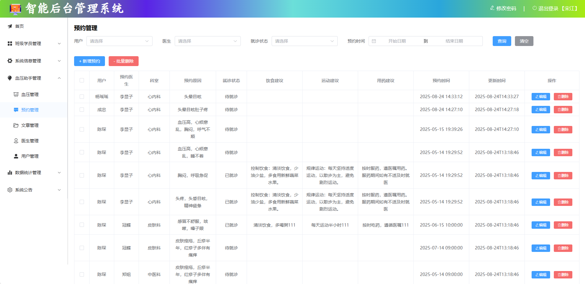

### 文章管理

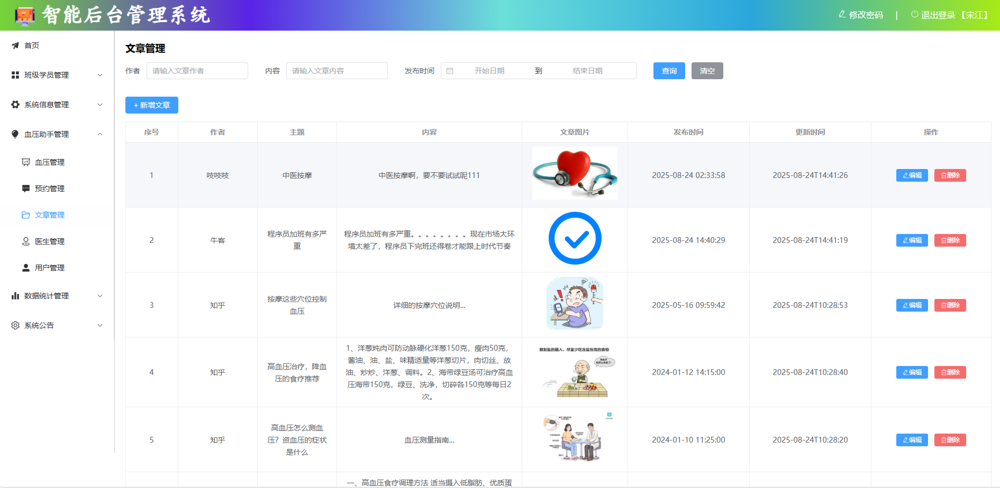

### 医生管理

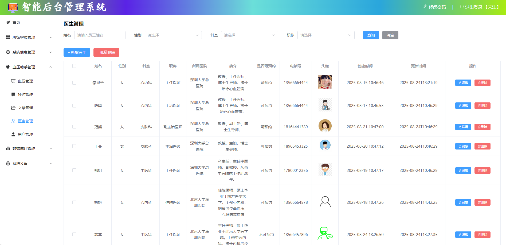

### 患者管理

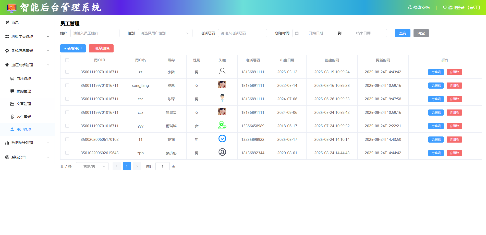

### 系统日志

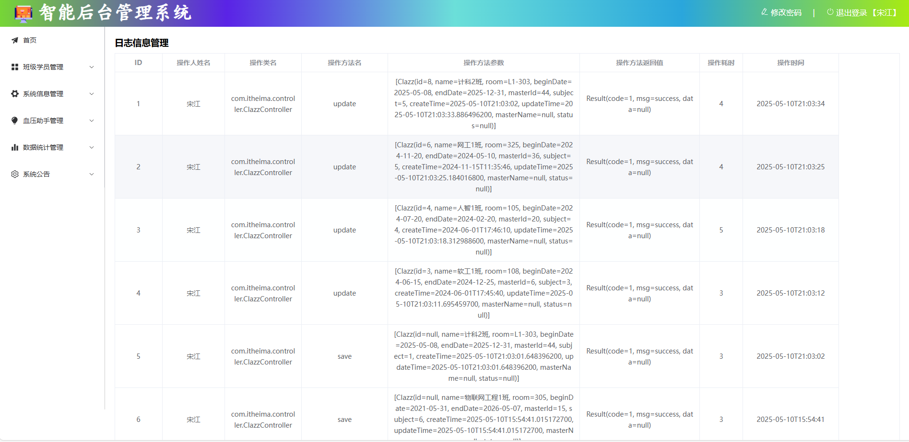

### 公告通知

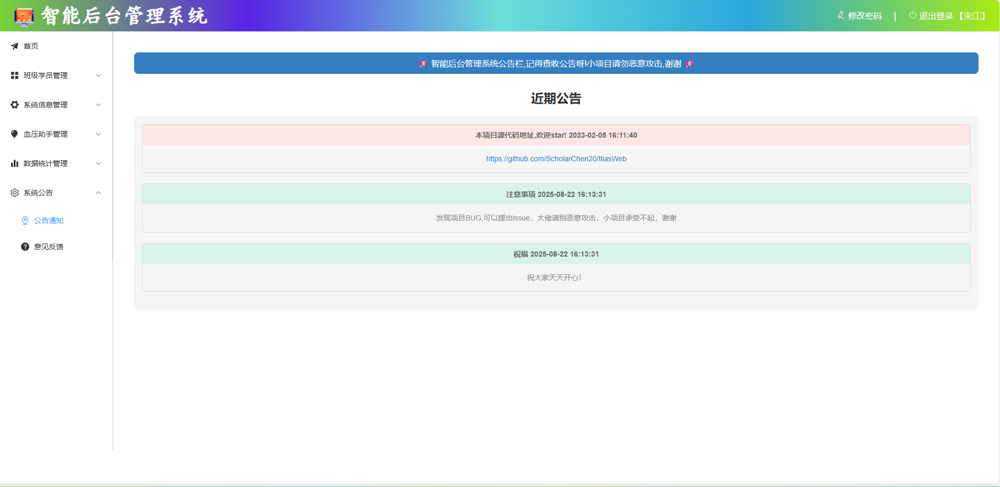

### 意见反馈

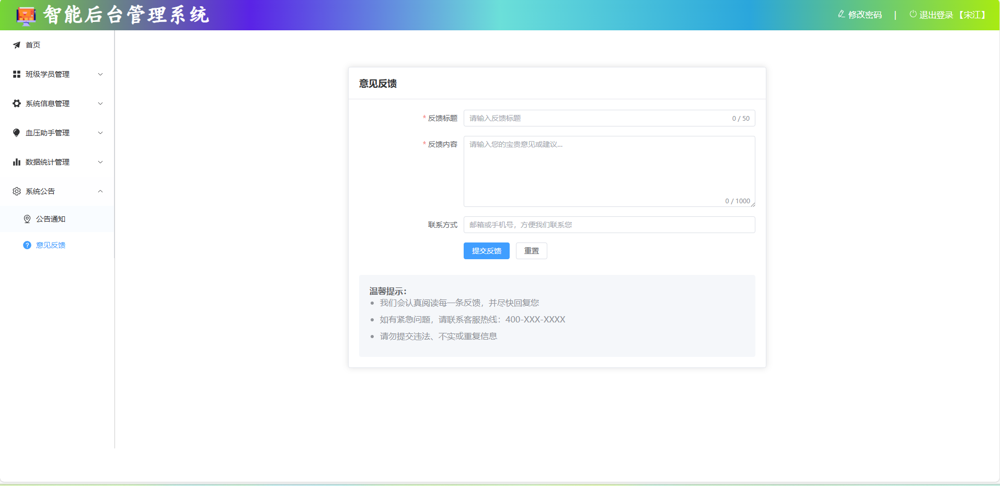

# vue

## Project setup
```
npm install
```

### Compiles and hot-reloads for development
```
npm run serve
```

### Compiles and minifies for production
```
npm run build
```

### Customize configuration
See [Configuration Reference](https://cli.vuejs.org/config/).
